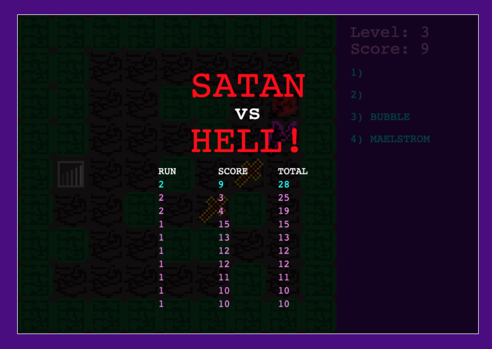

## SATAN vs HELL
There is a traitor in Hell.

Satan takes on all of Pandemonium in the fight to regain his unholy throne!

A Roguelike or Broughlike or whatever!
# [Play here](https://mateor.github.io/satan_vs_hell)

### Playing
Kill demons with Satan's unholy wrath. Gather arcane treasures to wield dark magics.

* **1! Satan!**
* **5! Enemies!**
* **15! Spells!**
* **6! Levels! of! Hell!**

Kill, learn, die, repeat.

#### Controls
* `WASD` movements
* `1-9` spells

### Running the Game
[Play the game online](https://mateor.github.io/satan_vs_hell/) or download this repo and open `index.html` in your favorite browser.

### Credits
* Game Design and code ported from @nluqo's [great Broughlike](https://nluqo.github.io/broughlike-tutorial)
* Art, Sounds, and "Story" by @mateor
  - Pixel art made in [GIMP](https://www.gimp.org)
  - Game sounds created using [`bxfr`](https://www.bfxr.net) from @increpare
